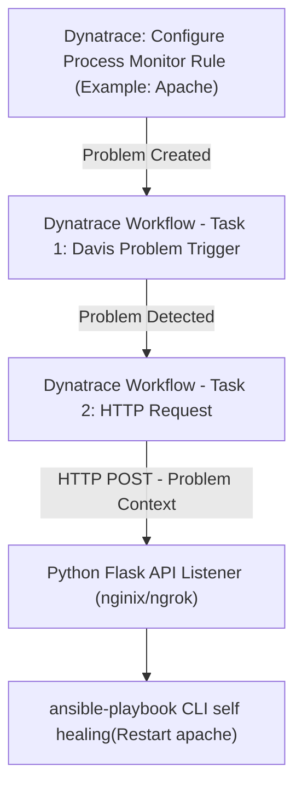

```mermaid
flowchart TD
    A["Dynatrace: Configure Process Monitor Rule (Example: Apache)"]    
    C["Dynatrace Workflow - Task 1: Davis Problem Trigger"]    
    E["Dynatrace Workflow - Task 2: HTTP Request"]
    F["Python Flask API Listener (nginix/ngrok)"]
    G["ansible-playbook CLI self healing(Restart apache)"]

    A -->|Problem Created| C    
    C -->|Problem Detected|E    
    E -->|HTTP POST - Problem Context| F
    F --> G

```