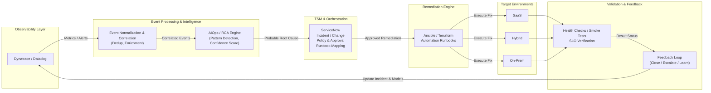

```mermaid
flowchart LR
    %% ===============================
    %% Observability Layer
    %% ===============================
    subgraph OBS["Observability Layer"]
        DT["Dynatrace / Datadog"]
    end

    %% ===============================
    %% Event Processing & Intelligence
    %% ===============================
    subgraph INTEL["Event Processing & Intelligence"]
        EN["Event Normalization & Correlation<br/>(Dedup, Enrichment)"]
        RCA["AIOps / RCA Engine<br/>(Pattern Detection, Confidence Score)"]
    end

    %% ===============================
    %% ITSM & Orchestration
    %% ===============================
    subgraph ITSM["ITSM & Orchestration"]
        SN["ServiceNow<br/>Incident / Change<br/>Policy & Approval<br/>Runbook Mapping"]
    end

    %% ===============================
    %% Automation & Remediation
    %% ===============================
    subgraph AUTO["Remediation Engine"]
        REM["Ansible / Terraform<br/>Automation Runbooks"]
    end

    %% ===============================
    %% Target Environment
    %% ===============================
    subgraph ENV["Target Environments"]
        SAAS["SaaS"]
        HYB["Hybrid"]
        ONP["On-Prem"]
    end

    %% ===============================
    %% Validation & Feedback
    %% ===============================
    subgraph VAL["Validation & Feedback"]
        HC["Health Checks / Smoke Tests<br/>SLO Verification"]
        FB["Feedback Loop<br/>(Close / Escalate / Learn)"]
    end

    %% ===============================
    %% Flow
    %% ===============================
    DT -->|"Metrics / Alerts"| EN
    EN -->|"Correlated Events"| RCA
    RCA -->|"Probable Root Cause"| SN
    SN -->|"Approved Remediation"| REM
    REM -->|"Execute Fix"| SAAS
    REM -->|"Execute Fix"| HYB
    REM -->|"Execute Fix"| ONP
    SAAS --> HC
    HYB --> HC
    ONP --> HC
    HC -->|"Result Status"| FB
    FB -->|"Update Incident & Models"| DT

```